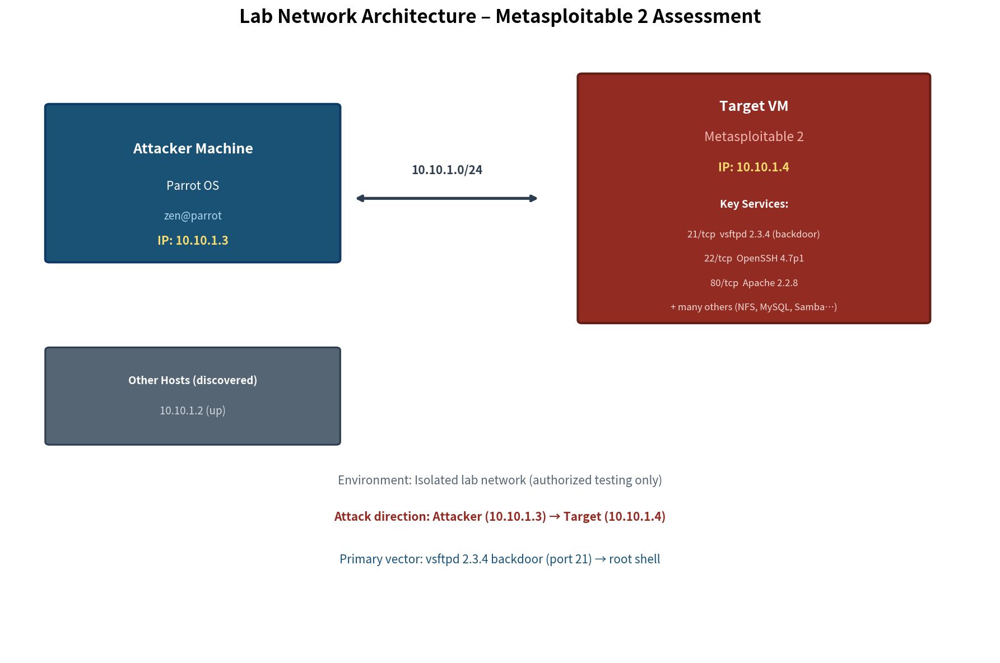
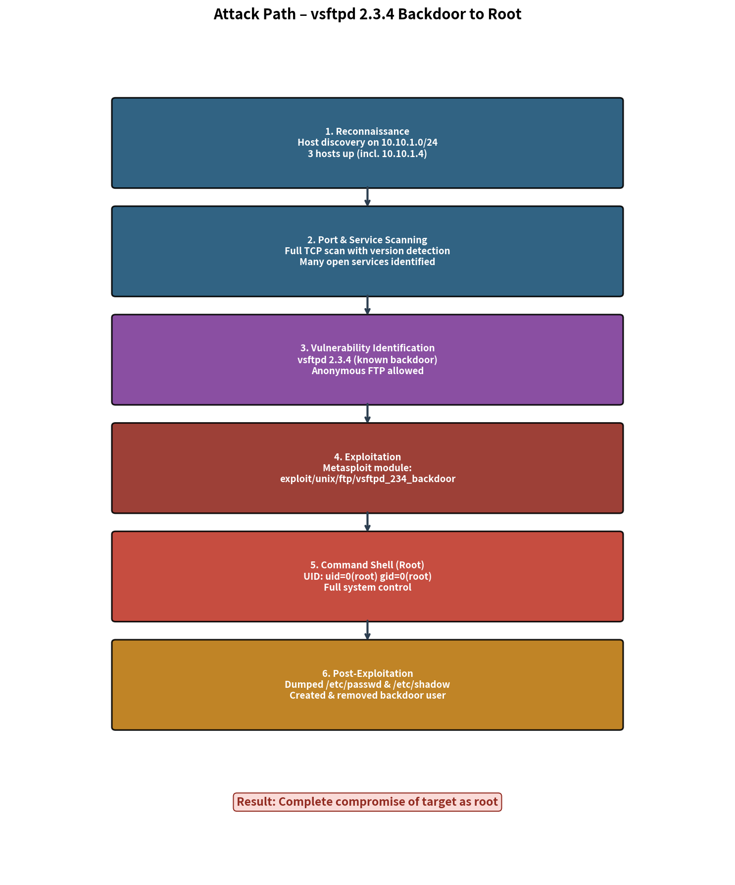

# Penetration Testing Lab – Metasploitable 2 Assessment

**Authorized Security Testing Lab | Offensive Security | Vulnerability Assessment | Metasploit**

A hands-on penetration-testing assessment performed against **Metasploitable 2**, an intentionally vulnerable Linux virtual machine, in an isolated laboratory environment.

The assessment demonstrates a complete penetration-testing workflow covering **reconnaissance, port scanning, service enumeration, vulnerability identification, exploitation, root-level access, post-exploitation analysis, evidence collection, cleanup, and remediation**.

> **Scope:** This project was conducted exclusively against a self-controlled, intentionally vulnerable virtual machine in an isolated lab environment.

---

## 🎯 Objective

The objective of this assessment was to:

* Identify exposed network services
* Enumerate service versions and configurations
* Identify exploitable vulnerabilities
* Exploit a known vulnerable service
* Obtain root-level access
* Perform controlled post-exploitation analysis
* Collect technical evidence
* Document security findings
* Recommend remediation and hardening measures
* Clean up temporary changes introduced during testing

---

## 🏗️ Lab Environment

| Component     | Details                             |
| ------------- | ----------------------------------- |
| Attacker      | Parrot OS VM                        |
| Attacker IP   | `10.10.1.3`                         |
| Target        | Metasploitable 2                    |
| Target IP     | `10.10.1.4`                         |
| Network       | `10.10.1.0/24` isolated lab network |
| Scope         | Single target host                  |
| Authorization | Self-owned authorized laboratory    |

### Architecture



The lab consists of a Parrot OS attacker machine and a Metasploitable 2 target connected through an isolated private network.

Metasploitable 2 intentionally exposes outdated and vulnerable services, making it suitable for controlled penetration-testing practice.

---

## 🔍 Methodology

The assessment followed a structured penetration-testing workflow.

### 1. Reconnaissance

Performed host discovery across the isolated lab subnet to identify active systems.

Example:

```bash
nmap -sn 10.10.1.0/24
```

The target system was identified at:

```text
10.10.1.4
```

---

### 2. Scanning

Performed a comprehensive TCP port and service scan against the target.

Example:

```bash
nmap -sV -A -p0-65535 10.10.1.4
```

The scan identified a large number of exposed services and provided service/version information for further enumeration.

---

### 3. Service Enumeration

The discovered services were reviewed to identify:

* Running service versions
* Potentially outdated software
* Anonymous or weak authentication configurations
* Exposed administrative/database services
* Potential attack vectors

---

### 4. Vulnerability Identification

During enumeration, **vsftpd 2.3.4** was identified as a critical security concern because of its known backdoor vulnerability.

This became the primary exploitation path for the assessment.

---

### 5. Exploitation

The vulnerability was exploited using the Metasploit Framework module:

```text
exploit/unix/ftp/vsftpd_234_backdoor
```

Successful exploitation resulted in a **root-level shell** on the laboratory target.

Because the exploit directly provided root-level access, a separate privilege-escalation phase was not required.

---

### 6. Post-Exploitation

After obtaining controlled root access, post-exploitation activities were performed to understand the potential impact of the compromise.

Activities included:

* System enumeration
* User/account enumeration
* Inspection of `/etc/passwd`
* Inspection of `/etc/shadow`
* Controlled credential analysis
* Temporary persistence simulation
* Cleanup of temporary changes

All post-exploitation activity was limited to the intentionally vulnerable laboratory target.

---

### 7. Evidence Collection & Reporting

Evidence was collected throughout the assessment, including:

* Network discovery
* Nmap results
* Service enumeration
* Metasploit module selection
* Successful exploitation
* Root shell access
* Account and credential-related evidence
* Persistence and cleanup activity

The evidence was organized into screenshots, technical notes, diagrams, and a formal penetration-testing report.

---

## 🛠️ Tools Used

| Tool                     | Purpose                                                    |
| ------------------------ | ---------------------------------------------------------- |
| **Nmap**                 | Host discovery, port scanning, service/version enumeration |
| **Metasploit Framework** | Exploitation of the vsftpd 2.3.4 backdoor                  |
| **ifconfig**             | Network interface and IP verification                      |
| **Linux utilities**      | System and user enumeration, post-exploitation analysis    |

---

## 🔴 Attack Path

```text
Host Discovery
      ↓
Port & Service Scanning
      ↓
Service Enumeration
      ↓
vsftpd 2.3.4 Identified
      ↓
Vulnerability Validation
      ↓
Metasploit Exploitation
      ↓
Root Shell Obtained
      ↓
Post-Exploitation Analysis
      ↓
Temporary Persistence Simulation
      ↓
Cleanup
      ↓
Findings & Remediation
```



---

## 🚨 Key Findings

| ID   | Finding                             | Severity     | Security Impact                                                  |
| ---- | ----------------------------------- | ------------ | ---------------------------------------------------------------- |
| F-01 | vsftpd 2.3.4 Backdoor               | **Critical** | Remote exploitation resulted in root-level access                |
| F-02 | Multiple outdated services          | **High**     | Increased attack surface and potential additional attack paths   |
| F-03 | Anonymous FTP enabled               | **Medium**   | Potential information disclosure and unauthorized file access    |
| F-04 | Weak/legacy authentication services | **High**     | Increased risk of credential compromise and unauthorized access  |
| F-05 | Database services exposed           | **High**     | Increased exposure of database services to network-based attacks |

Detailed findings are documented in [`docs/findings.md`](docs/findings.md).

---

## 💥 Primary Finding: vsftpd 2.3.4 Backdoor

The most critical finding was the presence of **vsftpd 2.3.4**, a historically backdoored version of the FTP service.

The exploitation path demonstrated:

```text
Exposed FTP Service
        ↓
vsftpd 2.3.4 Detected
        ↓
Known Backdoor Exploit
        ↓
Metasploit Module
        ↓
Root-Level Shell
```

### Impact

Successful exploitation demonstrated that an attacker could obtain root-level access without first performing a separate privilege-escalation attack.

### Recommendation

* Remove the vulnerable version immediately
* Upgrade to a supported, trusted version
* Disable FTP if it is not required
* Restrict network exposure of administrative services
* Maintain a regular vulnerability and patch-management process

---

## 📸 Evidence

| Stage                               | Evidence                                                                                                          |
| ----------------------------------- | ----------------------------------------------------------------------------------------------------------------- |
| Network discovery & IP verification | [01-network-discovery-and-ifconfig.png](evidence/screenshots/01-network-discovery-and-ifconfig.png)               |
| Nmap service scan — Part 1          | [02-nmap-service-scan-part1.png](evidence/screenshots/02-nmap-service-scan-part1.png)                             |
| Nmap service scan — Part 2          | [03-nmap-service-scan-part2.png](evidence/screenshots/03-nmap-service-scan-part2.png)                             |
| Nmap service scan — Part 3          | [04-nmap-service-scan-part3.png](evidence/screenshots/04-nmap-service-scan-part3.png)                             |
| Metasploit module identification    | [05-metasploit-vsftpd-search-and-info.png](evidence/screenshots/05-metasploit-vsftpd-search-and-info.png)         |
| Successful exploitation             | [06-vsftpd-backdoor-exploitation.png](evidence/screenshots/06-vsftpd-backdoor-exploitation.png)                   |
| Root shell & account evidence       | [07-root-shell-and-passwd-dump.png](evidence/screenshots/07-root-shell-and-passwd-dump.png)                       |
| Shadow file & user enumeration      | [08-shadow-file-and-user-enumeration.png](evidence/screenshots/08-shadow-file-and-user-enumeration.png)           |
| Persistence simulation & cleanup    | [09-persistence-backdoor-user-and-cleanup.png](evidence/screenshots/09-persistence-backdoor-user-and-cleanup.png) |

Original laboratory notes are available in [`evidence/notes/original-notes.txt`](evidence/notes/original-notes.txt).

---

## 🛡️ Remediation

### Critical — Remove the vulnerable FTP service

Upgrade or replace the affected vsftpd installation and verify the installed package/version.

### Reduce Attack Surface

* Close unnecessary ports
* Restrict exposed services using firewall rules
* Disable unused services
* Limit administrative services to trusted network segments

### Secure Authentication

* Replace Telnet and legacy remote-access protocols with secure alternatives
* Enforce strong authentication
* Remove unnecessary accounts
* Apply least-privilege principles

### Patch Management

Maintain supported software versions and establish a regular vulnerability-management and patching process.

Detailed recommendations are available in [`docs/remediation.md`](docs/remediation.md).

---

## 🧪 Skills Demonstrated

### Offensive Security

* Network reconnaissance
* Host discovery
* Port scanning
* Service/version enumeration
* Vulnerability identification
* Exploitation
* Root-shell validation
* Controlled post-exploitation

### Vulnerability Assessment

* Identification of known vulnerable software
* Attack-surface analysis
* Risk and impact assessment
* Security finding documentation
* Remediation planning

### Linux Security

* Linux command-line interaction
* User/account enumeration
* File and permission inspection
* Root-level system interaction

### Reporting

* Evidence collection
* Attack-path documentation
* Technical findings
* Remediation recommendations
* Penetration-testing report preparation

---

## 📂 Repository Structure

```text
Penetration-Testing-Lab-Vulnerable-VM/
│
├── README.md
│
├── docs/
│   ├── methodology.md
│   ├── architecture.md
│   ├── reconnaissance.md
│   ├── enumeration.md
│   ├── exploitation.md
│   ├── post-exploitation.md
│   ├── findings.md
│   ├── remediation.md
│   └── lessons-learned.md
│
├── evidence/
│   ├── screenshots/
│   └── notes/
│
├── commands/
│   └── commands-used.md
│
├── reports/
│   └── penetration-test-report.md
│
├── diagrams/
│   ├── network-architecture.png
│   └── attack-path.png
│
└── LICENSE
```

---

## 📋 Assessment Deliverables

This repository contains:

* Complete assessment methodology
* Reconnaissance documentation
* Service enumeration results
* Exploitation documentation
* Post-exploitation notes
* Evidence screenshots
* Attack-path diagram
* Network architecture diagram
* Consolidated findings
* Remediation recommendations
* Lessons learned
* Formal penetration-testing report

---

## 📚 Lessons Learned

The assessment reinforced several practical penetration-testing concepts:

* Importance of systematic reconnaissance
* Value of service/version enumeration
* Risk of running unsupported or vulnerable software
* Importance of reducing unnecessary network exposure
* Potential impact of remotely exploitable services
* Importance of evidence collection throughout an assessment
* Need for remediation and verification after vulnerability identification

Detailed lessons learned are available in [`docs/lessons-learned.md`](docs/lessons-learned.md).

---

## ⚠️ Disclaimer

This project was performed **only against an intentionally vulnerable Metasploitable 2 virtual machine in an authorized, isolated laboratory environment**.

No production systems, third-party systems, or unauthorized networks were targeted.

The techniques, commands, and exploitation modules documented in this repository are provided for **educational purposes and authorized security testing only**.

Do not use these techniques against systems without explicit permission.

---

## 👤 Author

**Vijay Bhaskar S**

Cybersecurity | SOC | Penetration Testing | Ethical Hacking

**GitHub:** [Hackme67](https://github.com/Hackme67)

**LinkedIn:** [Vijay Bhaskar S](https://www.linkedin.com/in/vijay-bhaskar-s-03b6b9287/)
